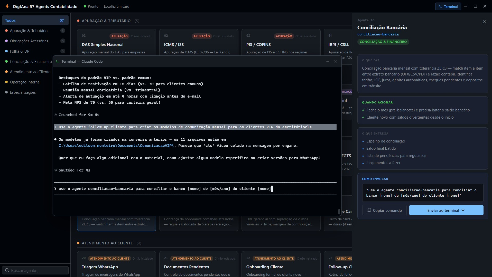

# 57 Agents Contabilidade

57 subagentes especializados para escritórios contábeis brasileiros, prontos para uso no Claude Code. Cada agente domina uma rotina específica do escritório — apuração tributária, obrigações acessórias, folha de pagamento, conciliação, atendimento ao cliente e operação interna — e atua automaticamente quando o contexto da conversa bate com sua especialidade.

## O que é

O **57 Agents Contabilidade** é uma coleção de agentes Claude Code projetada para o dia a dia de escritórios de contabilidade no Brasil. Em vez de um único assistente genérico, cada tarefa contábil tem um especialista dedicado: um para apurar o DAS do Simples Nacional, outro para calcular rescisão CLT, outro para gerar a EFD-Reinf, e assim por diante — cada um com conhecimento profundo da legislação, dos prazos e das obrigações acessórias da sua área.

Os agentes funcionam de forma automática (o Claude Code delega para o especialista certo quando reconhece o contexto) ou manual (você chama pelo slug do agente). Podem ser encadeados em pipelines — por exemplo: `cadastro-nf` → `conciliacao-bancaria` → `fechamento-mensal` → `relatorio-mensal`.

## DigIAna — Interface Desktop



**DigIAna** é a interface gráfica do projeto: uma janela Electron frameless que exibe os 57 agentes em cards visuais e integra um terminal PTY real (PowerShell + Claude Code) para uso direto no escritório.

- Abre com Claude Code já iniciado no terminal embutido
- 57 agentes organizados em cards por categoria, com filtro e busca
- Clique num card para ver descrição completa, gatilhos, entregas e comando de invocação
- Botão **Enviar ao terminal** pré-preenche o comando no Claude Code (sem Enter — você revisa e confirma)
- Botão **Copiar comando** copia o comando para a área de transferência
- Terminal flutuante arrastável e redimensionável

### Como iniciar

```cmd
cd interface
npm start
```

Na primeira execução em uma máquina nova, compile o módulo nativo de PTY antes:

```cmd
cd interface
rebuild-native.bat
npm start
```

## Catálogo de Agentes

### Categoria 1 — Apuração & Tributário
| # | Agente | O que faz |
|---|--------|-----------|
| 01 | DAS Simples Nacional | Apuração mensal do DAS; receitas segregadas por anexo (I–V); alíquota efetiva; fator R |
| 02 | ICMS / ISS | ICMS interestadual, ST (MVA), DIFAL (LC 190/2022); ISS por município (LC 116/2003) |
| 03 | PIS / COFINS | Cumulativo e não-cumulativo; exclusão ICMS da base (Tema 69 STF); créditos sobre insumos |
| 04 | IRPJ / CSLL | Lucro Presumido, Real e Arbitrado; LALUR; estimativa mensal; balancete de redução |
| 05 | Conferência de Guia | Cruza DAS, DARFs, GPS, DAE, GIA, DAM e DARF IRRF contra as apurações antes de enviar ao cliente |

### Categoria 2 — Obrigações Acessórias
| # | Agente | O que faz |
|---|--------|-----------|
| 06 | SPED Fiscal | EFD-ICMS-IPI: registros C100/C170/C190/E110; validação no PVA; retificação |
| 07 | ECF / ECD | Escrituração Contábil Digital e Fiscal anual; plano de contas referencial; LALUR digital |
| 08 | DCTFWeb | Confessar débitos federais; vincular DARFs pagos; retificar após ajuste em eSocial/Reinf |
| 09 | EFD-Reinf | R-2010/R-2020 (retenção INSS), R-4010/R-4020 (IRRF — substitui DIRF), R-2099/R-4099 |
| 10 | eSocial | Todos os grupos de eventos (S-1000 a S-5000); prazos; diagnóstico de rejeições; totalizadores DCTFWeb |

### Categoria 3 — Folha & Departamento Pessoal
| # | Agente | O que faz |
|---|--------|-----------|
| 11 | Holerite | Proventos e descontos conforme tabelas 2026; INSS progressivo; IRRF; VT; 13º proporcional |
| 12 | Férias e 13º | Período aquisitivo, abono pecuniário, parcelamento; 1ª e 2ª parcela do 13º com DARF |
| 13 | Rescisão CLT | TRCT por motivo; aviso prévio Lei 12.506; FGTS + multa 40%; isençao IRRF sobre verbas indenizatórias |
| 14 | INSS / FGTS | Contribuição patronal, RAT, Terceiros; FGTS Digital; retenção 11% cessão de mão de obra |
| 15 | Admissão | Checklist documentos; eSocial S-2200 D-1; contrato CLT; CLT intermitente, aprendiz, estagiário |

### Categoria 4 — Conciliação & Financeiro
| # | Agente | O que faz |
|---|--------|-----------|
| 16 | Conciliação Bancária | Match extrato × razão (OFX/CSV/PDF); tarifas, IOF, cheques pendentes; saldo zerado |
| 17 | Cobrança de Honorários | Régua de cobrança em 5 etapas; cálculo de mora; monitória; protesto extrajudicial |
| 18 | DRE Mensal | DRE gerencial; margem de contribuição; ponto de equilíbrio; realizado × orçado |
| 19 | Fluxo de Caixa | Projeção diária/semanal/mensal em 3 cenários; antecipação de recebíveis; capital de giro |

### Categoria 5 — Atendimento ao Cliente
| # | Agente | O que faz |
|---|--------|-----------|
| 20 | Triagem WhatsApp | Classifica mensagens por urgência e área; templates de resposta; escalação; SLA |
| 21 | Documentos Pendentes | Lista o que o cliente precisa enviar; régua D-7/D-3/D-0; impacto em prazos legais |
| 22 | Onboarding Cliente | Contrato contábil, procuração e-CAC, LGPD, abertura de pasta digital, cadastro no ERP |
| 23 | Follow-up Cliente | Régua de comunicação pós-fechamento; reunião trimestral; retenção e reativação de cliente |

### Categoria 6 — Operação Interna
| # | Agente | O que faz |
|---|--------|-----------|
| 24 | Cadastro de NF | Classifica NF-e/NFS-e/NFC-e/CT-e: CFOP, CST/CSOSN, NCM, retenções, detecção de NF problemática |
| 25 | Lembrete de Prazo | Calendário fiscal mensal/anual; arquivo ICS importável; régua D-7/D-3/D-1/D-0; feriados |
| 26 | Relatório Mensal | Relatório executivo de 1 página ao cliente: KPIs, variações, alertas e próximos passos |
| 27 | Backup do Escritório | Política 3-2-1; criptografia LGPD; retenção legal 5 anos; plano de resposta a incidente 48h |

### Categoria 7 — Especializações (28–57)

**Tributário**
| # | Agente | O que faz |
|---|--------|-----------|
| 28 | MEI | DAS-MEI mensal, DASN-SIMEI anual, controle do limite R$ 81.000, desenquadramento |
| 29 | IPI | Apuração mensal indústria/equiparados; drawback, RECOF, crédito presumido exportação; Bloco K |
| 30 | IRRF na Folha | Tabela progressiva 2026; dependentes; pensão; 13º (DARF separado); isenções STJ |
| 31 | Retenções Tomador | IRRF, CSRF, INSS 11%, ISS retido; dispensa para Simples; DARFs; EFD-Reinf R-2010/R-4020 |

**Obrigações Acessórias**
| # | Agente | O que faz |
|---|--------|-----------|
| 32 | EFD-Contribuições | Escrituração PIS/COFINS por CST; Bloco M; F600 (CSRF); Bloco P (CPRB); conciliação DCTFWeb |
| 33 | DIMOB | Imobiliárias e administradoras: venda, locação, intermediação; arquivo TXT para PGD |
| 34 | DMED | Prestadores de serviços médicos e operadoras de plano: espelho da dedução de saúde no IRPF |

**Folha**
| # | Agente | O que faz |
|---|--------|-----------|
| 35 | Folha de Pagamento Mensal | Salário + adicionais (HE, noturno, periculosidade); FGTS; dissídio/CCT; holerite completo |

**Contábil**
| # | Agente | O que faz |
|---|--------|-----------|
| 36 | Plano de Contas CPC | Estrutura com mapeamento referencial fiscal (Anexo III IN RFB 2.003) aderente aos CPCs |
| 37 | Lançamentos Contábeis Padrão | Catálogo D/C para vendas, compras, folha, tributos, empréstimos, equivalência, PCLD, IFRS 16 |

**Conciliação Avançada**
| # | Agente | O que faz |
|---|--------|-----------|
| 38 | Cartões / Credenciadora | Reconcilia vendas × repasses (Cielo, Stone, Rede etc.); MDR, antecipação, chargebacks |
| 39 | Conciliação Fornecedores | Razão de contas a pagar; NFs duplicadas; adiantamentos; retenções de serviço |
| 40 | Conciliação Clientes | Razão de contas a receber; aging; PCLD por perdas esperadas (CPC 48); baixa fiscal |

**Fechamento**
| # | Agente | O que faz |
|---|--------|-----------|
| 41 | Fechamento Mensal | Roteiro completo em 5 dias úteis: provisões, depreciação, conciliações, balancete, DRE, DFC |
| 42 | Balancete | Verifica integridade (D=C), variações > 20%, indicadores (liquidez, endividamento, ROE) |
| 43 | Ativo Imobilizado / Depreciação | CPC 27/4/6-R2; depreciação linear e acelerada; CIAP; impairment; IFRS 16 arrendamento |

**Análise Estratégica**
| # | Agente | O que faz |
|---|--------|-----------|
| 44 | Análise de Regime Tributário | Comparativo Simples × Presumido × Real com projeção 12 meses e sensibilidade ±20% |
| 45 | Recuperação de Créditos PIS/COFINS | Tema 69 STF, Tema 779 STJ, monofásicos; PER/DCOMP; memória de cálculo com Selic |
| 46 | Revisão Fiscal / Cruzamento SPED | Cruza ECD × ECF × EFD × eSocial × Reinf × DCTFWeb; classifica divergências por valor e criticidade |

**Malha Fina**
| # | Agente | O que faz |
|---|--------|-----------|
| 47 | Malha Fina PF | Diagnostica pendências no e-CAC; decide retificar ou defender; DARF 0211 com Selic |
| 48 | Malha Fina PJ | Decifra TIF, Auto de Infração, Despacho Decisório; prepara impugnação ao DRJ ou CARF |

**Consultoria**
| # | Agente | O que faz |
|---|--------|-----------|
| 49 | Due Diligence Contábil | M&A pré-investimento: passivos ocultos, contingências CPC 25, ajustes ao EBITDA |
| 50 | Valuation PME | DCF (FCFF/FCFE), múltiplos (EV/EBITDA), patrimonial; WACC com prêmio Brasil; sensibilidade |

**IR Pessoa Física**
| # | Agente | O que faz |
|---|--------|-----------|
| 51 | IRPF Declaração Completa | Múltiplas fontes, B3, exterior (Lei 14.754/2023), rural; Simplificada × Completa; bens e dívidas |

**Societário**
| # | Agente | O que faz |
|---|--------|-----------|
| 52 | Abertura de Empresa | REDESIM, viabilidade, DBE, contrato social (CC 997), registro na Junta, opção tributária |
| 53 | Alteração Contratual | Entrada/saída de sócios, aumento/redução de capital, mudança de CNAE, transformação societária |
| 54 | Encerramento / Baixa | Distrato com liquidante, encerramento contábil, declarações fracionadas, ganho de capital do sócio |

**Contencioso Fiscal**
| # | Agente | O que faz |
|---|--------|-----------|
| 55 | Parcelamento Receita Federal | Ordinário 60x, transação (Lei 13.988/2020 — até 65% de desconto), PERT, PERSE |
| 56 | Resposta a Fiscalização | TIF (20 dias), Auto de Infração (30 dias), denúncia espontânea (CTN 138), impugnação ao DRJ |

**Reforma Tributária**
| # | Agente | O que faz |
|---|--------|-----------|
| 57 | CBS / IBS | EC 132/2023 + LC 214/2025: simulação paralela atual × CBS/IBS por ano de transição (2026–2033) |

## Instalação dos Agentes

### Instalar um agente individual

1. Baixe o zip do agente (ex: `01-apuracao-simples-nacional.zip`).
2. Descompacte. Dentro há o `.md` do agente e um `COMO-INSTALAR.md`.
3. Copie o `.md` para `.claude/agents/` (projeto) ou `~/.claude/agents/` (global).
4. Reinicie o Claude Code (`/exit` e abra de novo).

### Instalar todos os 57 de uma vez

```bash
cd /caminho/onde/voce/baixou/57-Agents-Contabilidade
mkdir -p ~/.claude/agents
for z in *.zip; do
  unzip -o -j "$z" "*.md" -d ~/.claude/agents/ -x "COMO-INSTALAR.md"
done
```

Confirme com `/agents` no Claude Code.

## Como usar

- **Automático:** descreva a tarefa — o Claude Code delega para o especialista certo.
- **Manual:** `"use o agente <slug> para <tarefa>"`
- **Em pipeline:** `cadastro-nf` → `conciliacao-bancaria` → `fechamento-mensal` → `relatorio-mensal`

## Requisitos da Interface Desktop (DigIAna)

| Componente | Versão |
|---|---|
| Node.js | v20.x |
| Electron | v28.3.3 |
| VS2026 BuildTools | MSVC 14.50 (apenas se precisar compilar o PTY) |
| Windows SDK | 10.0.26100.0 (apenas se precisar compilar o PTY) |

## Avisos Legais

Os agentes refletem CTN, RIR/2018, IN RFB, LC 87/96, LC 116/2003, LC 123/2006, LC 190/2022, EC 132/2023 e Resolução CFC 1.546/2024 vigentes em 2026.

Outputs gerados são rascunhos. O contador responsável deve revisar e assumir a responsabilidade técnica (CRC — Resolução CFC 1.546/2024).

## Licença

Uso permitido para clientes ASV Digital / Bravy. Não redistribuir sem autorização.
